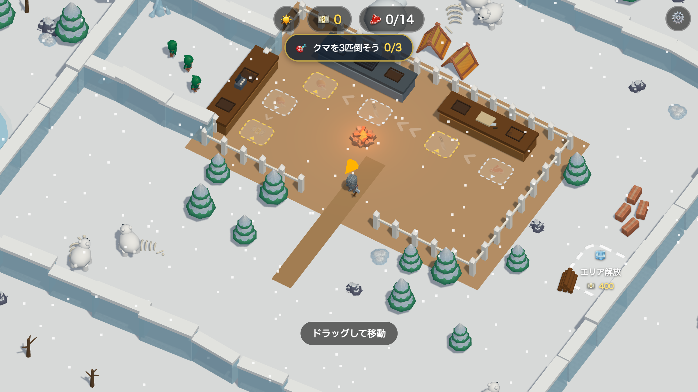

# Mini Games

ブラウザでそのまま遊べるミニゲーム集。ビルド不要の静的サイト(GitHub Pages 配信)。

## ❄️ Arctic Survivor

**▶ 遊ぶ: https://bambootuna.github.io/mini-games/arctic-survivor/**

雪原で拠点を育てるサバイバル経営ミニゲーム。クマを狩って肉を加工・販売し、稼いだお金で施設と拠点を拡張していく。モバイルタッチ + PC(WASD/マウス)対応。

- Three.js + 素の ES Modules(ビルドなし)
- 3D モデル/効果音: [KayKit](https://kaylousberg.itch.io/kaykit-adventurers) / [Kenney](https://kenney.nl/)(いずれも CC0)
